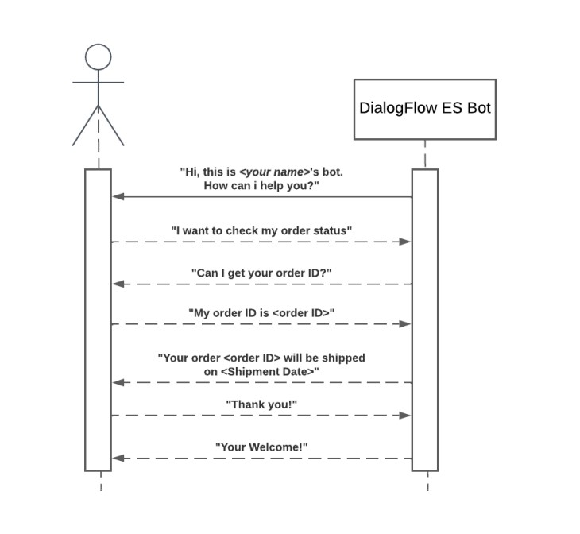

# Order Status Dialogflow Bot and REST API.

## Overview.

* This project centers around deploying a Dialogflow conversational bot with a webhook designed to inquire about order status. Simultaneously, a REST API is implemented using Flask and hosted on Microsoft Azure as a cloud platform. This API acts as the webhook, streamlining the process of fetching shipment details. Users can seamlessly retrieve shipment information by providing the relevant order ID through the bot.

* The REST API is currently operational as a web application on Microsoft Azure. You can access the API via the following URL: saad-orderstatusbot.azurewebsites.net. This cloud-based deployment ensures scalability, reliability, and accessibility, allowing users to enjoy efficient interactions with the bot and obtain real-time shipment updates.

## Usage.

* Use the /get_shipment route or https://saad-orderstatusbot.azurewebsites.net/get_shipment to get the shipment details. Use a POST request using Postman or any other API testing tool to send the order ID in the request body.

* The request body should be in JSON format and contain the order ID as shown below:
```json
{
  "queryResult": {
    "queryText": "my order id is 233",
    "parameters": {
      "number": 233
    }
  }
}
```

## Objectives.

### Dialogflow Bot Setup:

* Setup a Dialogflow ES bot using Dialogflow Console.

* Build the conversational flow as depicted in the sequence diagram Fig. 1 provided.


### REST API Development:

* Create a Flask REST API to receive webhook requests from the Dialogflow bot.
* Process the WebhookRequest to extract the user-provided order ID.
* Make a POST request to the provided API endpoint to fetch shipment date.
* Return the WebhookResponse with the appropriate details as per the sequence diagram.


## Sequence Diagram:




## Getting Started.

### Prerequisites:

* Dialogflow ES account: Dialogflow Console.

* Python and Flask installed for the API development.


### Installation:

1. Clone the repo
   ```sh
   git clone https://github.com/saadsaleem10/OrderStatusBot-DialogFlow-REST-API.git
   cd OrderStatusBot-DialogFlow-REST-API
   ```

2. Install dependencies
   ```sh
   pip install -r requirements.txt
   ```

3. Run the Flask API
   ```sh
    python app.py
    ```
    The API should be accessible at http://localhost:5000.


4. Expose localhost using ngrok for testing
   ```sh
   ngrok http 5000
   ```
   Copy the ngrok URL to set up Dialogflow webhook.


## Dialogflow Configuration:

* Set up Dialogflow intent with webhook fulfillment using the ngrok URL.

* Test the bot in the Dialogflow console or any supported platform.


## Demo Video:

[](https://www.youtube.com/watch?v=VIDEO-ID)


## Optional Tasks:

* Convert shipment date to a human-readable format.

* Deploy the Flask API to a cloud platform like AWS and Azure.


## API Details

### API URL: https://orderstatusapi-dot-organization-project-311520.uc.r.appspot.com/api/getOrderStatus

### Method: POST

### Request Body:
```json
{
    "orderid": "12345"
}
```

### Response Body:
```json
{
    "shipmentDate": "2021-08-01T00:00:00Z",
}
